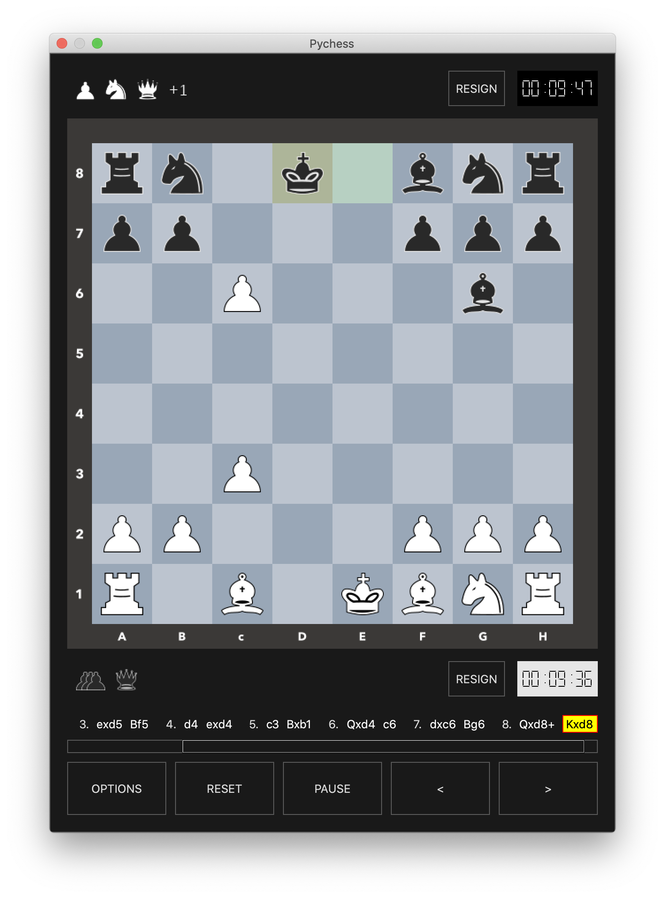
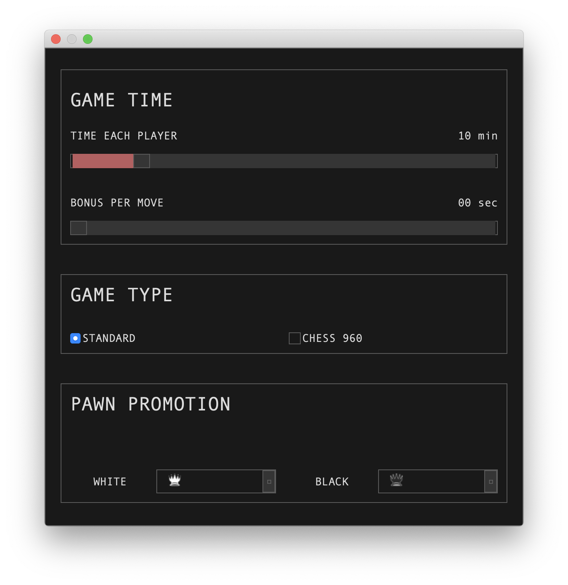

# pychess

The game of Chess in python







## Installation
You can use one of the following two options

### Installing by cloning the source code
```
$ git clone git@github.com:/alok1974/pychess.git
$ cd pychess
$ pip install .
```

### or

### Installing directly from github repo using pip
```
$ python -m pip install git+https://git@github.com/alok1974/pychess.git@master#egg=pychess
```

## Running
```
$ pychess
```

Enjoy!